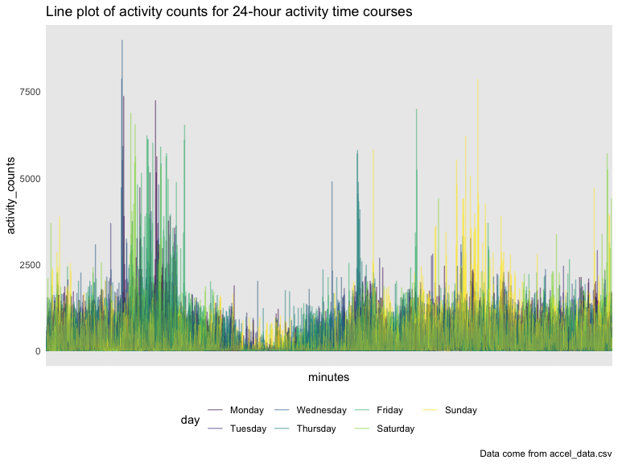
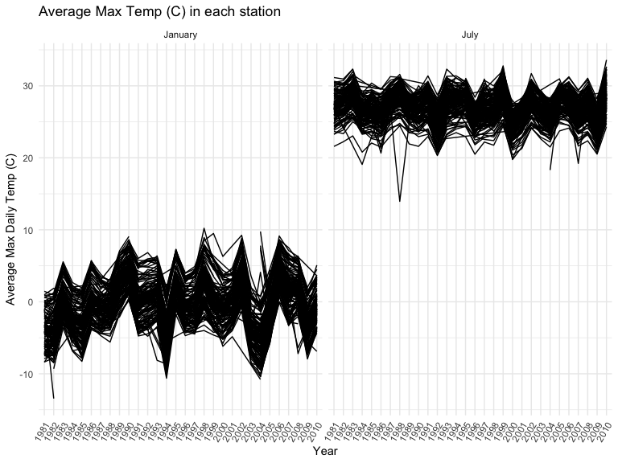
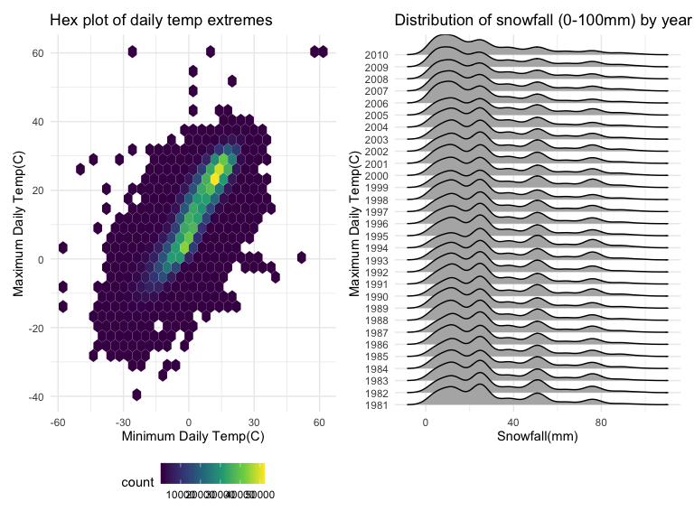

p8105_hw3_zc2691
================
2022-10-11

## Problem 1

``` r
data("instacart")

instacart = 
  instacart %>% 
  as_tibble(instacart)
```

``` r
summary(instacart)
```

    ##     order_id         product_id    add_to_cart_order   reordered     
    ##  Min.   :      1   Min.   :    1   Min.   : 1.000    Min.   :0.0000  
    ##  1st Qu.: 843370   1st Qu.:13380   1st Qu.: 3.000    1st Qu.:0.0000  
    ##  Median :1701880   Median :25298   Median : 7.000    Median :1.0000  
    ##  Mean   :1706298   Mean   :25556   Mean   : 8.758    Mean   :0.5986  
    ##  3rd Qu.:2568023   3rd Qu.:37940   3rd Qu.:12.000    3rd Qu.:1.0000  
    ##  Max.   :3421070   Max.   :49688   Max.   :80.000    Max.   :1.0000  
    ##     user_id         eval_set          order_number      order_dow    
    ##  Min.   :     1   Length:1384617     Min.   :  4.00   Min.   :0.000  
    ##  1st Qu.: 51732   Class :character   1st Qu.:  6.00   1st Qu.:1.000  
    ##  Median :102933   Mode  :character   Median : 11.00   Median :3.000  
    ##  Mean   :103113                      Mean   : 17.09   Mean   :2.701  
    ##  3rd Qu.:154959                      3rd Qu.: 21.00   3rd Qu.:5.000  
    ##  Max.   :206209                      Max.   :100.00   Max.   :6.000  
    ##  order_hour_of_day days_since_prior_order product_name          aisle_id    
    ##  Min.   : 0.00     Min.   : 0.00          Length:1384617     Min.   :  1.0  
    ##  1st Qu.:10.00     1st Qu.: 7.00          Class :character   1st Qu.: 31.0  
    ##  Median :14.00     Median :15.00          Mode  :character   Median : 83.0  
    ##  Mean   :13.58     Mean   :17.07                             Mean   : 71.3  
    ##  3rd Qu.:17.00     3rd Qu.:30.00                             3rd Qu.:107.0  
    ##  Max.   :23.00     Max.   :30.00                             Max.   :134.0  
    ##  department_id      aisle            department       
    ##  Min.   : 1.00   Length:1384617     Length:1384617    
    ##  1st Qu.: 4.00   Class :character   Class :character  
    ##  Median : 8.00   Mode  :character   Mode  :character  
    ##  Mean   : 9.84                                        
    ##  3rd Qu.:16.00                                        
    ##  Max.   :21.00

``` r
instacart[1,]
```

    ## # A tibble: 1 × 15
    ##   order_id product_id add_to_c…¹ reord…² user_id eval_…³ order…⁴ order…⁵ order…⁶
    ##      <int>      <int>      <int>   <int>   <int> <chr>     <int>   <int>   <int>
    ## 1        1      49302          1       1  112108 train         4       4      10
    ## # … with 6 more variables: days_since_prior_order <int>, product_name <chr>,
    ## #   aisle_id <int>, department_id <int>, aisle <chr>, department <chr>, and
    ## #   abbreviated variable names ¹​add_to_cart_order, ²​reordered, ³​eval_set,
    ## #   ⁴​order_number, ⁵​order_dow, ⁶​order_hour_of_day

This dataset contains 1384617 rows and 15 columns, with each row
resprenting a single product from an instacart order. Variables include
identifiers for user, order, and product; the order in which each
product was added to the cart. There are several order-level variables,
describing the day and time of the order, and number of days since prior
order. Then there are several item-specific variables, describing the
product name (e.g. Yogurt, Avocado), department (e.g. dairy and eggs,
produce), and aisle (e.g. yogurt, fresh fruits), and whether the item
has been ordered by this user in the past. In total, there are 39123
products found in 131209 orders from 131209 distinct users.

Below is a table summarizing the number of items ordered from aisle. In
total, there are 134 aisles, with fresh vegetables and fresh fruits
holding the most items ordered by far.

``` r
instacart %>% 
  count(aisle) %>% 
  arrange(desc(n))
```

    ## # A tibble: 134 × 2
    ##    aisle                              n
    ##    <chr>                          <int>
    ##  1 fresh vegetables              150609
    ##  2 fresh fruits                  150473
    ##  3 packaged vegetables fruits     78493
    ##  4 yogurt                         55240
    ##  5 packaged cheese                41699
    ##  6 water seltzer sparkling water  36617
    ##  7 milk                           32644
    ##  8 chips pretzels                 31269
    ##  9 soy lactosefree                26240
    ## 10 bread                          23635
    ## # … with 124 more rows

Next is a plot that shows the number of items ordered in each aisle.
Here, aisles are ordered by ascending number of items.

``` r
instacart %>% 
  count(aisle) %>% 
  filter(n > 10000) %>% 
  mutate(aisle = fct_reorder(aisle, n)) %>% 
  ggplot(aes(x = aisle, y = n)) + 
  geom_point() + 
  labs(title = "Number of items ordered in each aisle") +
  theme(axis.text.x = element_text(angle = 60, hjust = 1))
```


Below is a table showing the three most popular items in each of the
aisles “baking ingredients”, “dog food care”, and “packaged vegetables
fruits”.

``` r
instacart %>% 
  filter (aisle == "baking ingredients" | aisle == "dog food care" | aisle == "packaged vegetables fruits") %>% 
  group_by(aisle) %>% 
  count(product_name) %>% 
  mutate(rank = min_rank(desc(n))) %>% 
  filter(rank < 4) %>% 
  arrange(desc(n)) %>%
  knitr::kable()
```

| aisle                      | product_name                                  |    n | rank |
|:---------------------------|:----------------------------------------------|-----:|-----:|
| packaged vegetables fruits | Organic Baby Spinach                          | 9784 |    1 |
| packaged vegetables fruits | Organic Raspberries                           | 5546 |    2 |
| packaged vegetables fruits | Organic Blueberries                           | 4966 |    3 |
| baking ingredients         | Light Brown Sugar                             |  499 |    1 |
| baking ingredients         | Pure Baking Soda                              |  387 |    2 |
| baking ingredients         | Cane Sugar                                    |  336 |    3 |
| dog food care              | Snack Sticks Chicken & Rice Recipe Dog Treats |   30 |    1 |
| dog food care              | Organix Chicken & Brown Rice Recipe           |   28 |    2 |
| dog food care              | Small Dog Biscuits                            |   26 |    3 |

Below is a table showing the mean hour of the day at which Pink Lady
Apples and Coffee Ice Cream are ordered on each day of the week.

``` r
instacart %>% 
  filter (product_name == "Pink Lady Apples" | product_name == "Coffee Ice Cream") %>% 
  group_by(product_name, order_dow) %>% 
  summarize(order_hour_of_day_mean = mean(order_hour_of_day)) %>% 
  pivot_wider(
    names_from = order_dow,
    values_from = order_hour_of_day_mean
  ) %>% 
  knitr::kable()
```

    ## `summarise()` has grouped output by 'product_name'. You can override using the
    ## `.groups` argument.

| product_name     |        0 |        1 |        2 |        3 |        4 |        5 |        6 |
|:-----------------|---------:|---------:|---------:|---------:|---------:|---------:|---------:|
| Coffee Ice Cream | 13.77419 | 14.31579 | 15.38095 | 15.31818 | 15.21739 | 12.26316 | 13.83333 |
| Pink Lady Apples | 13.44118 | 11.36000 | 11.70213 | 14.25000 | 11.55172 | 12.78431 | 11.93750 |

## Problem 2

``` r
accel = read_csv("./data/accel_data.csv") %>% 
  janitor::clean_names() %>% 
  pivot_longer(
    activity_1:activity_1440,
    names_to = "activity_num",
    values_to = "activity_counts"
  ) %>% 
  mutate(activity_num = sub("activity_", "", activity_num)) %>% 
  mutate(activity_counts = as.double(activity_counts))
```

    ## Rows: 35 Columns: 1443
    ## ── Column specification ────────────────────────────────────────────────────────
    ## Delimiter: ","
    ## chr    (1): day
    ## dbl (1442): week, day_id, activity.1, activity.2, activity.3, activity.4, ac...
    ## 
    ## ℹ Use `spec()` to retrieve the full column specification for this data.
    ## ℹ Specify the column types or set `show_col_types = FALSE` to quiet this message.

``` r
weekdays = c('Monday', 'Tuesday', 'Wednesday', 'Thursday', 'Friday') 
accel %>% 
  mutate(wDays = factor(accel$day %in% weekdays, levels=c(FALSE, TRUE), labels=c("weekend", "weekday"))) %>% 
  select(week, day_id, day, wDays, everything())
```

    ## # A tibble: 50,400 × 6
    ##     week day_id day    wDays   activity_num activity_counts
    ##    <dbl>  <dbl> <chr>  <fct>   <chr>                  <dbl>
    ##  1     1      1 Friday weekday 1                       88.4
    ##  2     1      1 Friday weekday 2                       82.2
    ##  3     1      1 Friday weekday 3                       64.4
    ##  4     1      1 Friday weekday 4                       70.0
    ##  5     1      1 Friday weekday 5                       75.0
    ##  6     1      1 Friday weekday 6                       66.3
    ##  7     1      1 Friday weekday 7                       53.8
    ##  8     1      1 Friday weekday 8                       47.8
    ##  9     1      1 Friday weekday 9                       55.5
    ## 10     1      1 Friday weekday 10                      43.0
    ## # … with 50,390 more rows

The resulting data set has 50400 variables and 5 observations in total.
The variables are `week`, `day_id`, `wDays`, `activity_num`, and
`activity_counts`. `Week`, `day_id`, and `day` describes the records the
observation week and day. The `activity_counts`describes activity counts
for each minute of a 24-hour day starting at midnight. `wDay` is a
factor variable that describes weekday vs weekend.

Next, the table shows the total activity counts via aggregation across
minutes for each day.The subject typically alternates the level of
physical activity every other day. In other words, he/she is more active
on one day and less active on the next day. The total_activity for
Saturday week 4 and 5 returns as 1440 results from summing up of every
account count of value “1” during the whole day. The possible reason is
that the subjective didn’t wear/use accelerometer on Saturdays in week 4
and 4 for personal reasons.

``` r
accel %>% 
  group_by(week, day) %>%
  summarize(
     activity_total = sum(activity_counts)
  ) %>% 
  pivot_wider(
    names_from = day,
    values_from = activity_total,
  ) %>% 
  select(week, Monday, Tuesday, Wednesday, Thursday, Friday, Saturday, Sunday) %>% 
  knitr::kable(digits = 2)
```

    ## `summarise()` has grouped output by 'week'. You can override using the
    ## `.groups` argument.

| week |    Monday |  Tuesday | Wednesday | Thursday |   Friday | Saturday | Sunday |
|-----:|----------:|---------:|----------:|---------:|---------:|---------:|-------:|
|    1 |  78828.07 | 307094.2 |    340115 | 355923.6 | 480542.6 |   376254 | 631105 |
|    2 | 295431.00 | 423245.0 |    440962 | 474048.0 | 568839.0 |   607175 | 422018 |
|    3 | 685910.00 | 381507.0 |    468869 | 371230.0 | 467420.0 |   382928 | 467052 |
|    4 | 409450.00 | 319568.0 |    434460 | 340291.0 | 154049.0 |     1440 | 260617 |
|    5 | 389080.00 | 367824.0 |    445366 | 549658.0 | 620860.0 |     1440 | 138421 |

Below is a single-panel plot that shows the 24-hour activity time
courses for each day and use color to indicate day of the week. The
baseline of physical activity across one week is below 2500 every
minute. The subject engaged with more physical activity early in the day
on weekdays while later in the day on Sundays. The possible reason is
that the subject exercises in the mornings on weekdays while exercises
in the afternoons and evenings on Sundays. The subject is active in
approximately fixed periods of time everyday in 5 weeks.

``` r
accel %>% 
  mutate(day = forcats::fct_relevel(day, c("Monday", "Tuesday", "Wednesday", "Thursday"))) %>%
  ggplot(aes(x = activity_num, y = activity_counts, color = day)) +
  geom_line(alpha = 0.5) +
  labs(
    x = "minutes",
    y = "activity_counts",
    title = "Line plot of activity counts for 24-hour activity time courses",
    caption = "Data come from accel_data.csv"
  ) +
  theme(axis.text.x = element_blank(), legend.position = "bottom")
```



## Problem 3

``` r
library(p8105.datasets)
data("ny_noaa")
ny_noaa = 
  ny_noaa %>% 
  as_tibble(ny_noaa)
```

``` r
ny_noaa
```

    ## # A tibble: 2,595,176 × 7
    ##    id          date        prcp  snow  snwd tmax  tmin 
    ##    <chr>       <date>     <int> <int> <int> <chr> <chr>
    ##  1 US1NYAB0001 2007-11-01    NA    NA    NA <NA>  <NA> 
    ##  2 US1NYAB0001 2007-11-02    NA    NA    NA <NA>  <NA> 
    ##  3 US1NYAB0001 2007-11-03    NA    NA    NA <NA>  <NA> 
    ##  4 US1NYAB0001 2007-11-04    NA    NA    NA <NA>  <NA> 
    ##  5 US1NYAB0001 2007-11-05    NA    NA    NA <NA>  <NA> 
    ##  6 US1NYAB0001 2007-11-06    NA    NA    NA <NA>  <NA> 
    ##  7 US1NYAB0001 2007-11-07    NA    NA    NA <NA>  <NA> 
    ##  8 US1NYAB0001 2007-11-08    NA    NA    NA <NA>  <NA> 
    ##  9 US1NYAB0001 2007-11-09    NA    NA    NA <NA>  <NA> 
    ## 10 US1NYAB0001 2007-11-10    NA    NA    NA <NA>  <NA> 
    ## # … with 2,595,166 more rows

``` r
summary(ny_noaa)
```

    ##       id                 date                 prcp               snow       
    ##  Length:2595176     Min.   :1981-01-01   Min.   :    0.00   Min.   :  -13   
    ##  Class :character   1st Qu.:1988-11-29   1st Qu.:    0.00   1st Qu.:    0   
    ##  Mode  :character   Median :1997-01-21   Median :    0.00   Median :    0   
    ##                     Mean   :1997-01-01   Mean   :   29.82   Mean   :    5   
    ##                     3rd Qu.:2005-09-01   3rd Qu.:   23.00   3rd Qu.:    0   
    ##                     Max.   :2010-12-31   Max.   :22860.00   Max.   :10160   
    ##                                          NA's   :145838     NA's   :381221  
    ##       snwd            tmax               tmin          
    ##  Min.   :   0.0   Length:2595176     Length:2595176    
    ##  1st Qu.:   0.0   Class :character   Class :character  
    ##  Median :   0.0   Mode  :character   Mode  :character  
    ##  Mean   :  37.3                                        
    ##  3rd Qu.:   0.0                                        
    ##  Max.   :9195.0                                        
    ##  NA's   :591786

``` r
ny_noaa = 
  ny_noaa %>% 
  janitor::clean_names() %>% 
  separate(date, c("year", "month", "day")) %>% 
  mutate(month = as.numeric(month)) %>% 
  mutate(month = month.name[month]) %>% 
  mutate(tmax = as.double(tmax)) %>% 
  mutate(tmin = as.double(tmin)) %>% 
  mutate(
    tmax = tmax/10,
    tmin = tmin/10)
```

`ny_noaa` dataframe has 2595176 rows and 9 columns, with 9 core
variables for all New York state weather stations from January 1, 1981
through December 31, 2010. Key variables include `id`: Weather station
ID, `year`, `month`, `day`: Date of observation, `prcp`: Precipitation
(tenths of mm), `snow`: Snowfall (mm), `snwd`: Snow depth (mm), `tmax`:
Maximum temperature (C), and `tmin`: Minimum temperature (C). The
dataset contains massive missing values because each weather station may
collect only a subset of these variables.

``` r
ny_noaa %>% 
  group_by(snow) %>% 
  summarize(
    n_obs = n()
  ) %>% 
  mutate(snow_rank = min_rank(desc(n_obs))) %>% 
  filter (snow_rank == 1) 
```

    ## # A tibble: 1 × 3
    ##    snow   n_obs snow_rank
    ##   <int>   <int>     <int>
    ## 1     0 2008508         1

The most commonly observed values is 0 because for the majority of time
during a year in most places, it didn’t snow. Snow only occurred in
winter so in spring, summer, and fall, it wasn’t likely to snow and the
snow fall would be 0.

Below is two-panel plot showing the average max temperature in January
and in July in each station across years. The general pattern of average
maximum daily temperature in each station is similar across years
1981-2010. We see a fluctuations between -10C and 10C in January and
between 20C to \~32C in June where the line graph is darkest due to
overlying. The notable outlier in January is in 1982 where the average
max daily temperature is much lower than -10C. The outlier in July is in
1988 where the average max temperature is below 15C.

``` r
ny_noaa %>% 
  filter(month %in% c("January","July")) %>% 
  group_by(month, year, id) %>% 
  summarize(
    tmax_mean = mean(tmax, na.rm = TRUE)
  ) %>% 
  ggplot(aes(x = year, y = tmax_mean, group = id)) +
  geom_line() +
  facet_grid(. ~month) +
  labs(
    x = "Year",
    y = "Average Max Daily Temp (C)",
    title = "Average Max Temp (C) in each station"
  ) +
  theme(axis.text.x = element_text(angle = 60, hjust = 1)) 
```

    ## `summarise()` has grouped output by 'month', 'year'. You can override using the
    ## `.groups` argument.



Next is a two-panel plot showing (i) tmax vs tmin for the full dataset
(note that a scatterplot may not be the best option); and (ii) make a
plot showing the distribution of snowfall values greater than 0 and less
than 100 separately by year.

``` r
tmax_tmin_p =
ny_noaa %>% 
  ggplot(aes(x = tmin, y = tmax))+
  geom_hex(data = ny_noaa) +
  labs(
    x = "Minimum Daily Temp(C)",
    y = "Maximum Daily Temp(C)",
    title = "Hex plot of daily temp extremes",
  ) +
  theme(legend.position = "bottom")

snow_p = 
  ny_noaa %>% 
  filter (snow > 0 & snow < 100) %>% 
  group_by(year) %>% 
  ggplot(aes(x = snow, y = year)) +
  geom_density_ridges() +
  labs(
    x = "Snowfall(mm)",
    y = "Maximum Daily Temp(C)",
    title = "Distribution of snowfall (0-100mm) by year",
  ) +
  theme(legend.position = "bottom")

tmax_tmin_p + snow_p
```

    ## Picking joint bandwidth of 3.76


